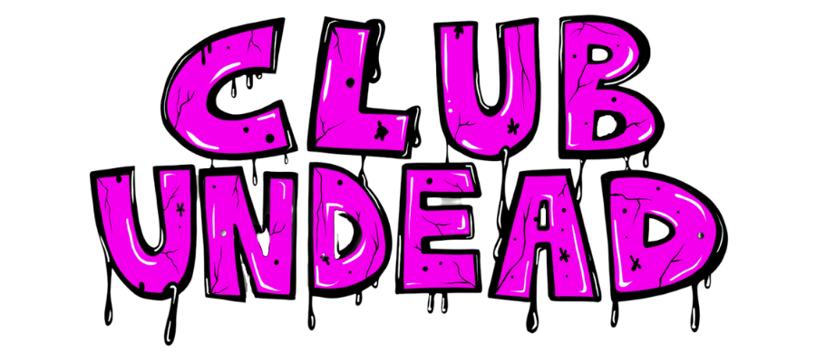
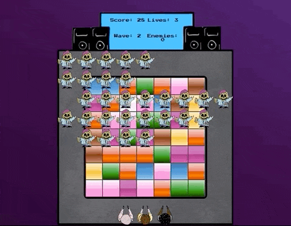

  

  My first project at General Assembly - a grid based game using HTML, CSS and JavaScript.

  

## The Brief

*	Render a game in the browser
*	Design a full game loop with win/loose conditions
*	Include separate HTML / CSS / JavaScript files
*	Stick with KISS (Keep It Simple Stupid) and DRY (Don't Repeat Yourself) principles
*	Use JavaScript for DOM manipulation
*	Deploy the game online, where the rest of the world can access it
*	Use semantic markup for HTML and CSS (adhere to best practices)

## Technologies Used

* HTML5
* Vanilla CSS3
* Vanilla JavaScript
* Git & GitHub
* Google Fonts
* GIMP image editing software
* Ableton Live 10

## Game Overview

For my first project on the software engineering immersive course at general assembly, we were given a week to create a grid based game as a solo endeavour, using a combination of the HTML, CSS, and JavaScript techniques that we had learned so far. Despite being taught a solid foundational knowledge within those technologies, the scope of this project was much larger than anything we had done so far, and the first assignment we had been set that we didn’t have explicit solutions for from previous classwork.

Given a sample collection of classic grid based games to model our projects upon, I opted for doing a spin on Space Invaders, a game where the player controls a turret that can move from left to right, shooting down a fleet of incoming space ships whilst avoiding the bombs that they drop and preventing them from reaching the bottom of the screen.

